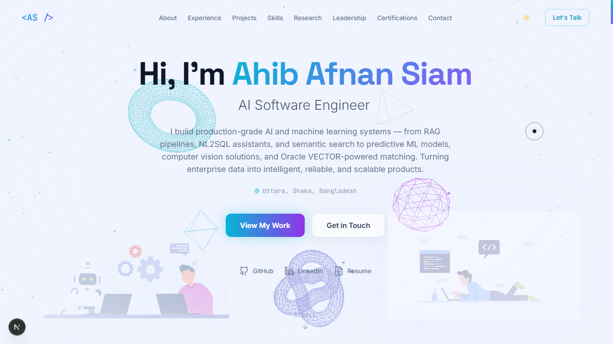

# Ahib Afnan Siam — AI Software Engineer Portfolio

A modern, production-focused personal portfolio showcasing work in AI engineering, machine learning, LLM systems, RAG, NL2SQL, semantic search, computer vision, research, and full-stack software development.

🌐 **Live Portfolio:** [ahib-afnan-siam.vercel.app](https://ahib-afnan-siam.vercel.app/)

## Preview



## Overview

This portfolio presents selected enterprise AI systems, software projects, research, technical writing, leadership experience, certifications, and professional background in one responsive Next.js application.

The homepage is intentionally curated for quick scanning, while dedicated routes expose the complete project, research, leadership, and certification collections.

## Highlights

- Production-focused AI engineering portfolio built with the Next.js App Router
- Live public and internal enterprise AI project showcase
- Interactive Three.js background with cursor-reactive motion
- Framer Motion transitions and Lottie-based visual effects
- Curated homepage with dedicated full-detail routes
- Typed, data-driven content architecture
- Responsive desktop, tablet, and mobile navigation
- Dark/light theme support
- Functional Nodemailer contact form
- SEO metadata, sitemap, robots, Open Graph, Twitter cards, and JSON-LD
- Protected admin route with cookie-based session authentication
- Deployed on Vercel

## Featured Work

The portfolio highlights production and research work including:

- **Uttoron** — Enterprise NL2SQL and analytics assistant
- **Hire360** — AI recruitment intelligence platform
- **MeetOS** — AI meeting intelligence agent
- **Engage360** — AI-assisted social automation platform
- Industrial computer vision and machine learning systems
- Research in federated learning and resource-efficient deep learning

## Tech Stack

| Area | Technology |
| --- | --- |
| Framework | Next.js 16, React 19 |
| Language | TypeScript |
| Styling | Tailwind CSS, CSS Variables |
| Animation | Framer Motion, Lottie |
| 3D | Three.js, React Three Fiber, Drei |
| Icons | Lucide React, React Icons |
| Email | Nodemailer, Gmail SMTP |
| Auth | Cookie-based admin session |
| SEO | Next Metadata API, JSON-LD, sitemap, robots, Open Graph, Twitter cards |
| Deployment | Vercel |

## Portfolio Sections

- About
- Experience
- Projects
- Technical Skills
- Research & Blogs
- Leadership
- Certifications & Achievements
- Contact

## Architecture

The portfolio uses the Next.js App Router with reusable section components and typed data modules.

- Homepage sections use curated `featured` content where appropriate
- Dedicated routes expose complete content collections
- Static content is stored in typed modules under `data/`
- Three.js powers the global animated background
- Framer Motion handles section animations and route transitions
- API routes handle contact email and admin authentication
- Next.js metadata APIs generate SEO and social-sharing metadata
- Homepage section links scroll locally; navigation links open dedicated routes

## Project Structure

```text
app/
├── (site)/              # Homepage and dedicated portfolio routes
├── admin/               # Protected admin dashboard and login
└── api/                 # Contact and admin API routes
assets/                  # Images and Lottie animation assets
components/
├── sections/            # Portfolio section components
├── three/               # Scene, particles, and floating objects
└── ui/                  # Shared navigation and interface components
data/                    # Typed portfolio datasets and icon references
hooks/                   # Client interaction hooks
lib/                     # Authentication and site utilities
public/                  # Public documents and static files
types/                   # Shared TypeScript types
```

## Getting Started

### Prerequisites

- Node.js 20+
- npm

### Installation

```bash
git clone https://github.com/Ahib-Afnan-Siam/Siam-Portfilo.git
cd Siam-Portfilo
npm install
npm run dev
```

Open [http://localhost:3000](http://localhost:3000) in your browser.

## Environment Variables

Create a `.env.local` file in the project root:

```env
NEXT_PUBLIC_SITE_URL=http://localhost:3000
NEXT_PUBLIC_GOOGLE_SITE_VERIFICATION=

SMTP_HOST=smtp.gmail.com
SMTP_PORT=465
SMTP_SECURE=true
SMTP_USER=your-email@gmail.com
SMTP_PASS=your-gmail-app-password
CONTACT_EMAIL_TO=your-email@gmail.com

ADMIN_EMAIL=admin@example.com
ADMIN_PASSWORD=replace-with-a-strong-password
ADMIN_SESSION_SECRET=replace-with-a-long-random-secret
```

For Gmail, use an App Password rather than a regular account password. Generate a session secret with:

```bash
node -e "console.log(require('crypto').randomBytes(32).toString('hex'))"
```

## Available Scripts

| Command | Purpose |
| --- | --- |
| `npm run dev` | Start the local development server |
| `npm run build` | Create an optimized production build |
| `npm run start` | Start the production server |

## Deployment

The portfolio is deployed on Vercel.

**Production:** [ahib-afnan-siam.vercel.app](https://ahib-afnan-siam.vercel.app/)

Configure the environment variables in the Vercel project settings before enabling the contact form or admin route. Pushes to the configured production branch trigger new deployments.

## Security Notes

- Never commit `.env.local`, SMTP credentials, Gmail App Passwords, or admin secrets.
- Use a strong, unique `ADMIN_PASSWORD` and a long random `ADMIN_SESSION_SECRET`.
- Keep `.env.example` limited to non-sensitive placeholder values.
- The `/admin` route requires configured credentials and a valid session cookie.

## Author

**Ahib Afnan Siam**  
AI Software Engineer — Dhaka, Bangladesh

- Portfolio: [ahib-afnan-siam.vercel.app](https://ahib-afnan-siam.vercel.app/)
- GitHub: [Ahib-Afnan-Siam](https://github.com/Ahib-Afnan-Siam)
- LinkedIn: [ahib-afnan-siam](https://www.linkedin.com/in/ahib-afnan-siam/)
- Email: [ahibafnan99@gmail.com](mailto:ahibafnan99@gmail.com)
